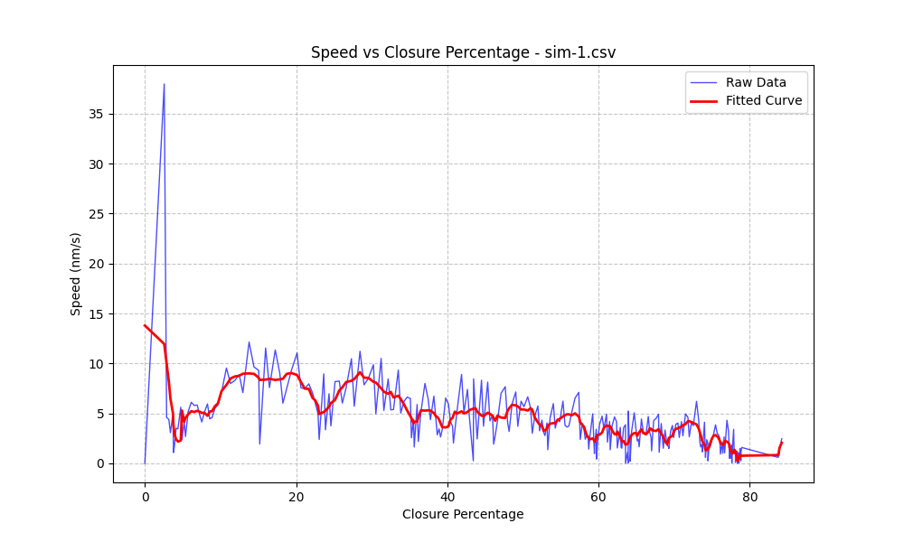
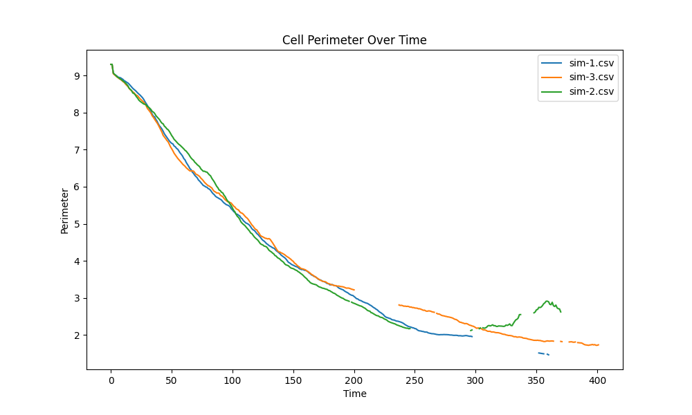
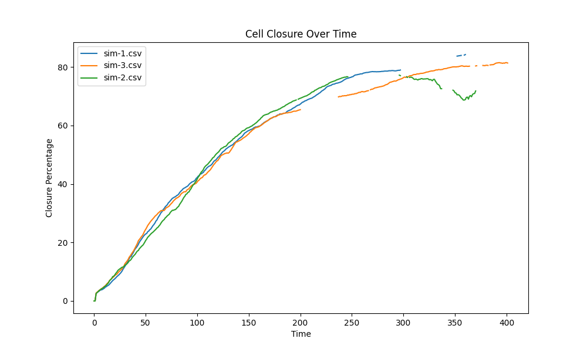

# Cytokinesis Analysis Tool

A Python-based tool for analyzing cell cytokinesis from coordinate data. This project processes CSV files containing x/y coordinates of cell boundaries over time, fits ellipses, and calculates various metrics including perimeter, closure percentage, and speed.

The tool was created in the [Lab of Amy Shaub Maddox](https://asmlab.web.unc.edu/) in Chapel Hill in 2019 with the assistance of Daniel Cortes, PhD. The purpose of the undergraduate project was to analyze the bioloigical accuracy of simulations.

### Cytosim 2D Simulator
##### A visual representation of Cytokinesis generated by [Cytosim](https://gitlab.com/f-nedelec/cytosim) an open-source cytoskeleton simulation suite by Francois Nedelec. 

## Features
- Ellipse fitting to cell boundaries
- Calculation of closure percentages and speeds
- Automated analysis of multuple simulation files
- Visualization of key metrics
- Statistical analysis of results

## Sample Results

From Cytosim, the two dimensional x/y coordinate data for each time-frame could be exported to a CSV file for processing. Sample coordinate data for three simulations are saved within the `data/` directory.

### Speed vs Closure Analysis for Simulation 1

### Perimeter vs Time Comparative Analysis

### Closure vs Time Comparative Analysis

